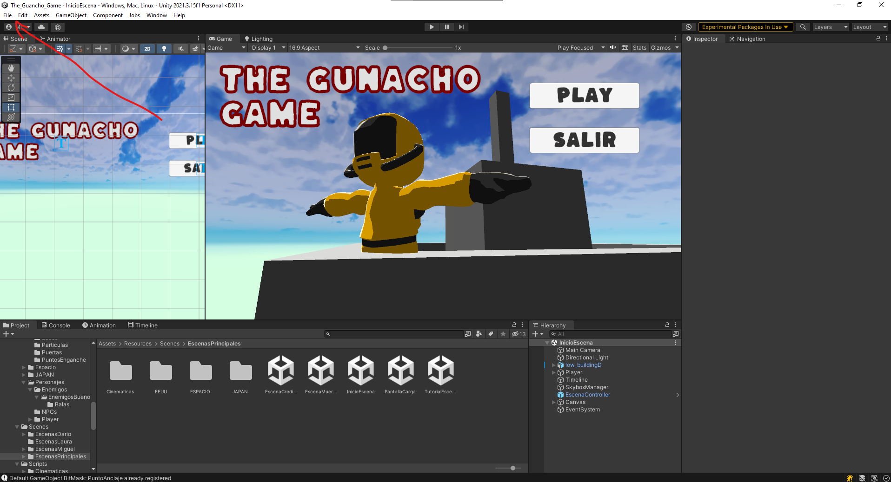
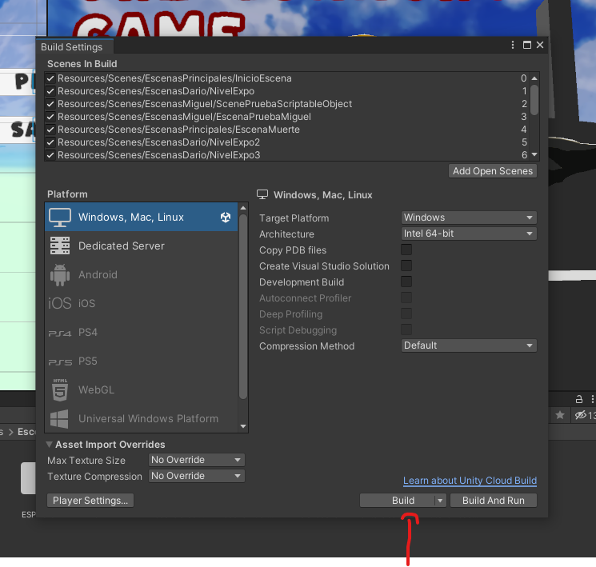
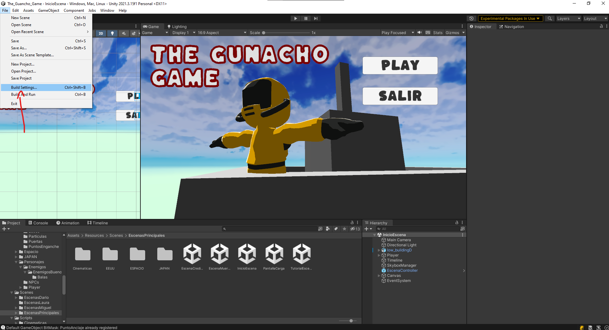
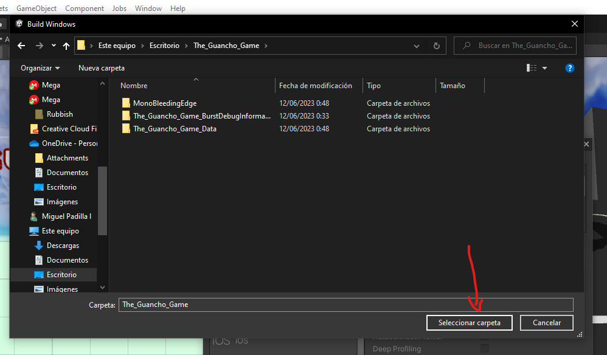

# TheGuanchoGame
 
## Build de The Guancho Game

Para hacer build del juego se hacer como de costumbre en unity.

La version que hay de instalar en Unity Hub es 2021.3.15f1.

Cuando este instalada la versión y abierto el proyecto pulsaremos el botón "File" situado arriba a la izquierda de unity.

Pulsamos Build Settings ...:

Después pulsamos el botón Build:

Seleccionamos la carpeta donde queremos que se haga la build y ya estaría:

